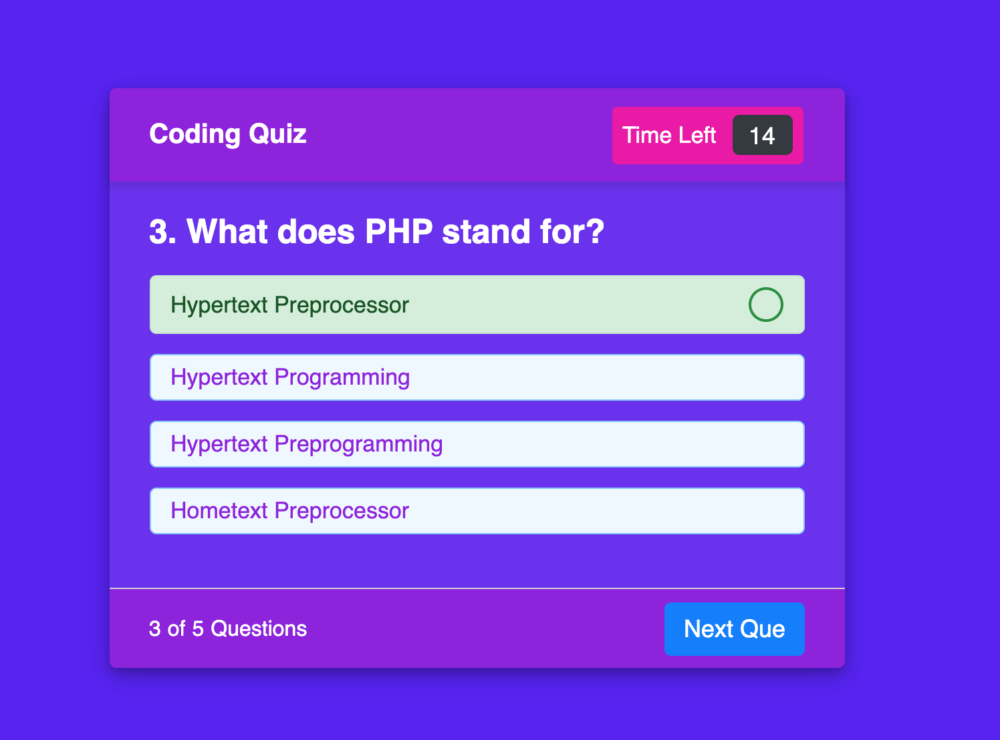

# coding-quiz

https://github.com/Yeatman51/coding-quiz

https://yeatman51.github.io/coding-quiz/

I created a custom coding quiz for future web developers to use and test their knowledge. After selecting the start quiz button you were given a little information on how the quiz is set up and then the choice to continue. There is a timer Included when taking the test. 

